# Building a Live SOC + Honeynet in Azure

## Introduction

In this project, I built a mini honeynet on Microsoft Azure by intentionally exposing virtual machines to the public internet. Logs from all resources were ingested into a Log Analytics Workspace, which Microsoft Sentinel used to build attack maps, trigger alerts, and create incidents.

I measured security metrics in the insecure environment for **24 hours**, then applied hardening controls based on **NIST SP 800-53**, measured again for **24 hours**, and compared the results.

**Metrics collected:**
- `SecurityEvent` — Windows logs (EventID 4625: failed RDP/MSSQL logins)
- `Syslog` — Linux logs (failed SSH attempts via LOG_AUTH)
- `SecurityAlert` — Alerts triggered by Microsoft Defender for Cloud
- `SecurityIncident` — Incidents automatically created by Sentinel
- `AzureNetworkAnalytics_CL` — Malicious flows allowed through NSGs

---

## Architecture

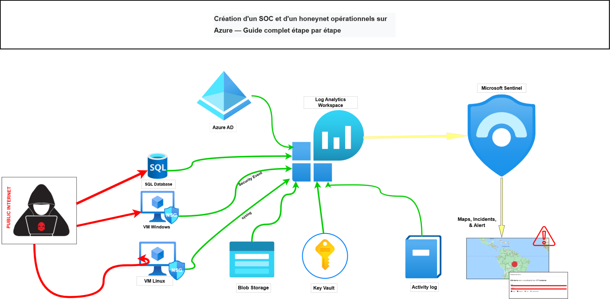

**Resources — Resource Group `SOC-Lab-RG` | France Central:**

| Resource | Name | Role |
|---|---|---|
| Virtual Network | `soc-lab-vnet` | Shared network |
| Windows VM | `SVR-CORPORATE` | Honeypot — RDP + SQL Server |
| Linux VM | `linux-vm` | Honeypot — SSH |
| NSG | `SVR-CORPORATE-nsg` | Cloud firewall Windows VM |
| NSG | `linux-vm-nsg` | Cloud firewall Linux VM |
| Log Analytics Workspace | `law-soc-lab` | Central log database |
| Microsoft Sentinel | — | SIEM |
| Key Vault | `kv-soclab-joe` | Secret store |
| Storage Account | `stsocjoe` | Blob storage |

---

## Phase 1 — Deploy the Honeypot Infrastructure

### Windows VM — SVR-CORPORATE

Windows Server 2022 VM with SQL Server 2022 installed, intentionally exposed on RDP (3389) and MSSQL (1433).

**NSG rule added — honeypot phase:**


Rule `DANGER_AllowAll` at priority 100 — all inbound traffic from anywhere, on any port, allowed.

Windows Defender Firewall disabled via `wf.msc` on all 3 profiles (Domain, Private, Public).

### Linux VM — linux-vm

Ubuntu 22.04 LTS, SSH (port 22) exposed. Same VNet as SVR-CORPORATE.

Linux firewall disabled: `sudo ufw disable`

Same `DANGER_AllowAll` rule added to `linux-vm-nsg`.

---

## Phase 2 — Configure Microsoft Sentinel

### Log Analytics Workspace

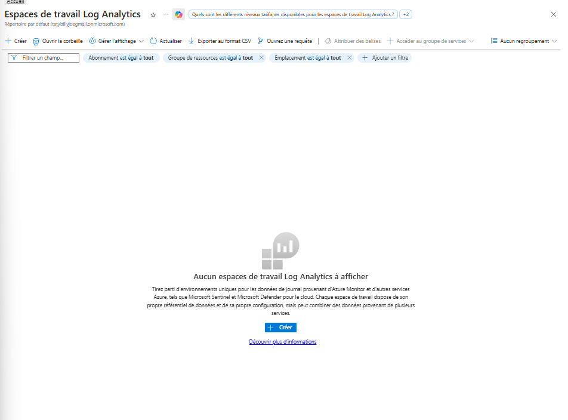

Created `law-soc-lab` — the central database receiving all logs from all resources.

### Sentinel Activation

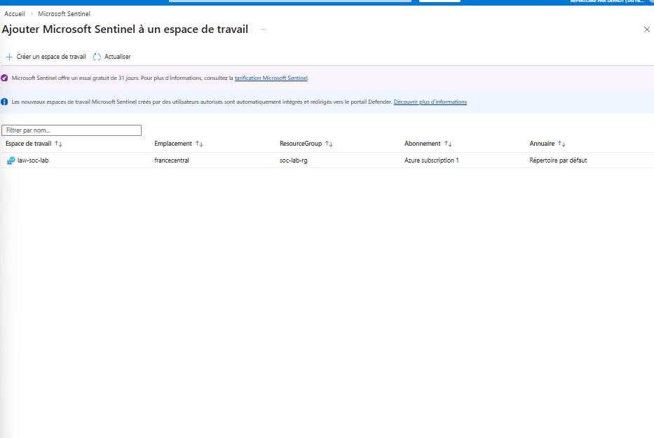


Microsoft Sentinel deployed on top of `law-soc-lab`. It ingests logs, runs KQL-based detection rules, creates incidents, and displays attack maps.

### Data Connector — Windows Security Events


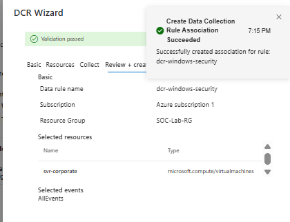

Connected `SVR-CORPORATE` via AMA. Collecting **All Security Events** — includes EventID 4625 (failed logins).

### Data Connector — Linux Syslog

Connected `linux-vm` via Syslog connector collecting `LOG_AUTH` and `LOG_AUTHPRIV`. This captures failed SSH attempts — the Linux equivalent of Windows EventID 4625.

### GeoIP Watchlist


Uploaded `geoip-summarized.csv` (~54,000 IP ranges with GPS coordinates) as a Sentinel Watchlist. Used by all attack map workbooks to geolocate attackers on a world map.

### Attack Map Workbooks


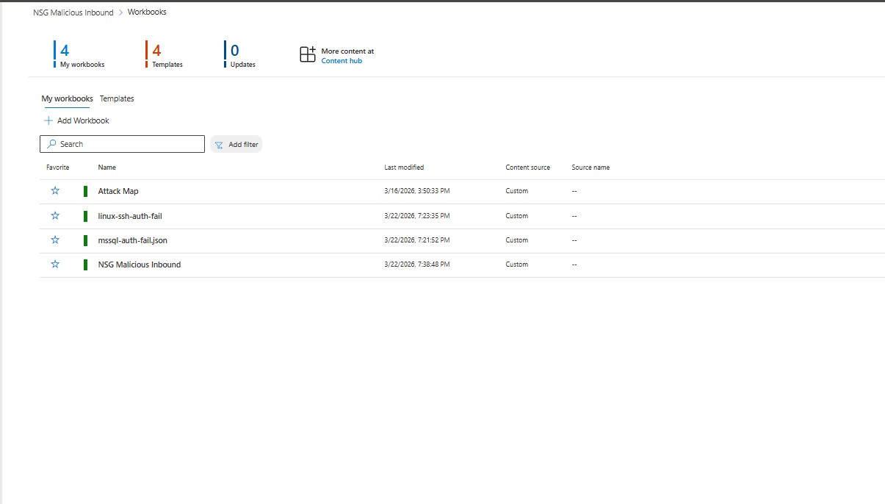

Imported 4 Azure Workbooks from the [`workbooks/`](workbooks/) folder:

| Workbook | What it monitors |
|---|---|
| `windows-rdp-auth-fail.json` | RDP brute-force on SVR-CORPORATE |
| `linux-ssh-auth-fail.json` | SSH brute-force on linux-vm |
| `mssql-auth-fail.json` | SQL Server login failures (port 1433) |
| `nsg-malicious-allowed-in.json` | Malicious traffic allowed by NSGs |

---

## Phase 3 — Honeynet Exposed for 24 Hours


Left both VMs fully exposed with no changes for 24 hours. Automated bots discovered the VMs within minutes and started RDP, SSH, and MSSQL brute-force attacks continuously.

---

## Phase 4 — Metrics BEFORE Hardening

### KQL Detection Queries

**Query 1 — All failed logins (EventID 4625):**

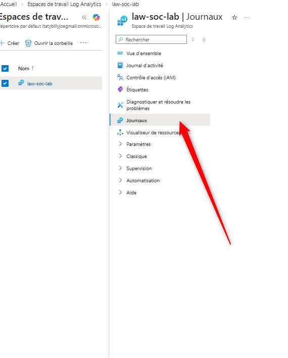

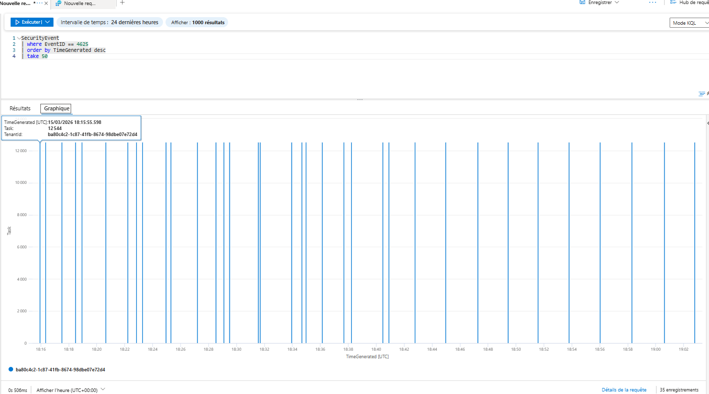

**Query 2 — Top attacking IPs:**

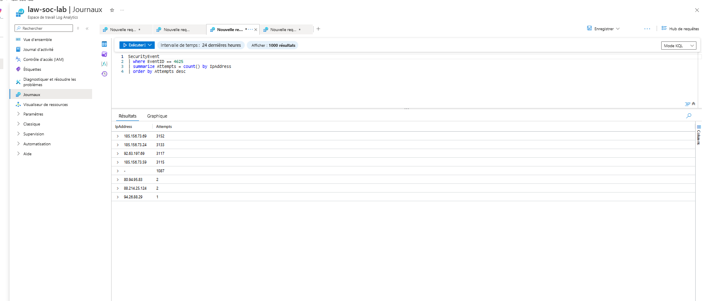

**Query 3 — Password Spray detection:**

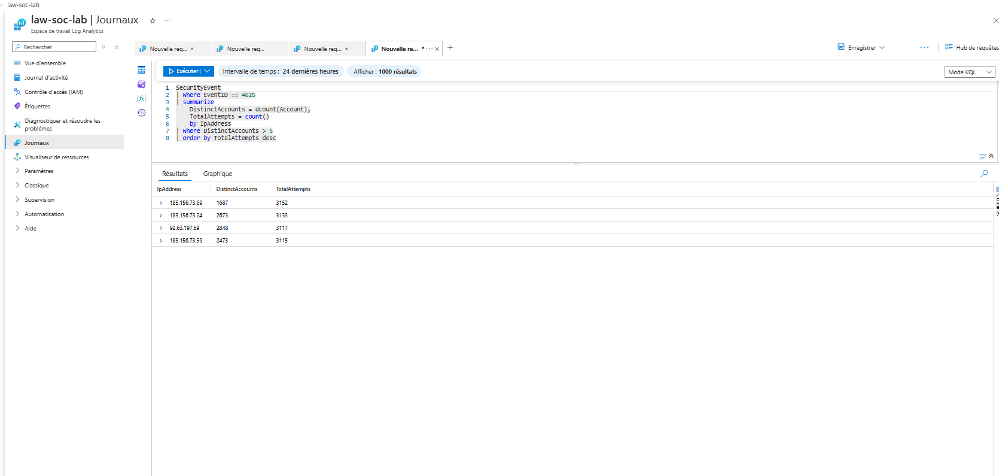

### Security Event Counts

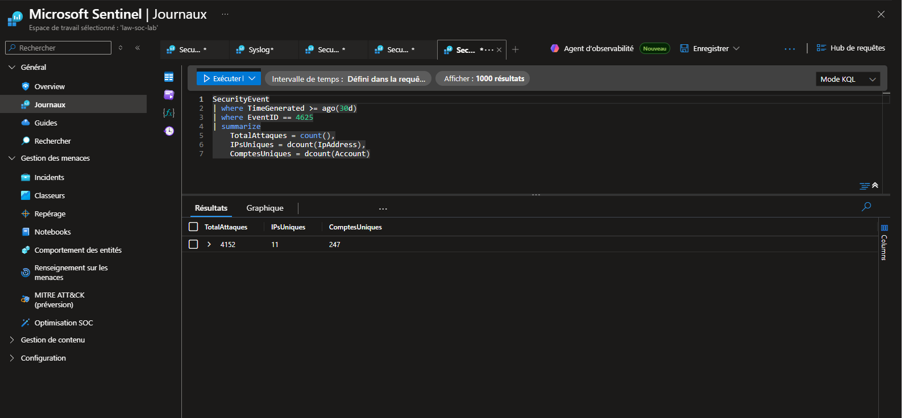


| Metric | Count |
|---|---|
| SecurityEvent (Windows) | **50,534** |
| Syslog (Linux) | **26,730** |
| SecurityAlert | **246** |
| SecurityIncident | **246** |
| AzureNetworkAnalytics_CL | *(populating)* |

> **Notable:** 4,152 RDP login attempts from **11 distinct IPs** targeting **247 different accounts** in under 24 hours.

### Attack Maps Before Hardening

**Windows RDP — SVR-CORPORATE:**

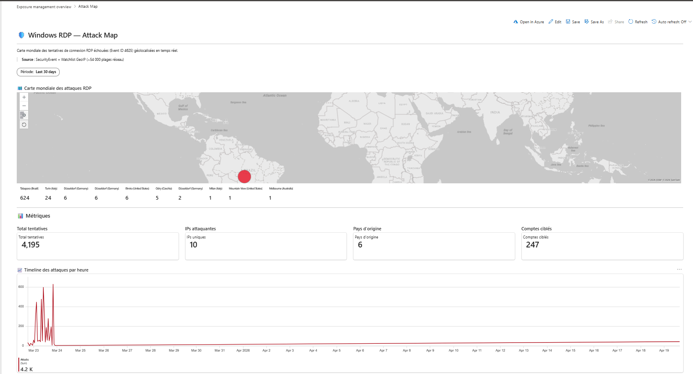

**Linux SSH — linux-vm:**


**MSSQL — SQL Server:**


---

## Phase 5 — Hardening (NIST SP 800-53)

### A — Re-enable Windows Firewall — SVR-CORPORATE

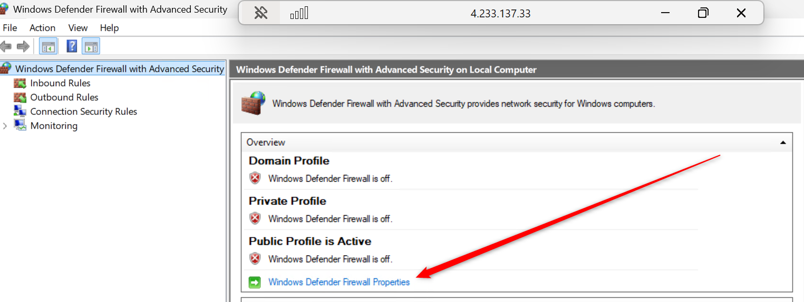

`Win+R` → `wf.msc` → Domain + Private + Public profiles → **On** → Apply.

### B — Re-enable Linux Firewall — linux-vm

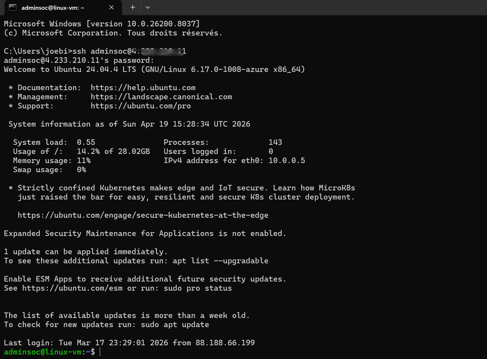

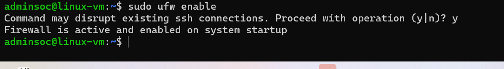

```bash
sudo ufw enable
sudo ufw allow from <MY_IP> to any port 22
sudo ufw status verbose
```

### C — Lock Down NSG — SVR-CORPORATE


Deleted rule `DANGER_AllowAll`.

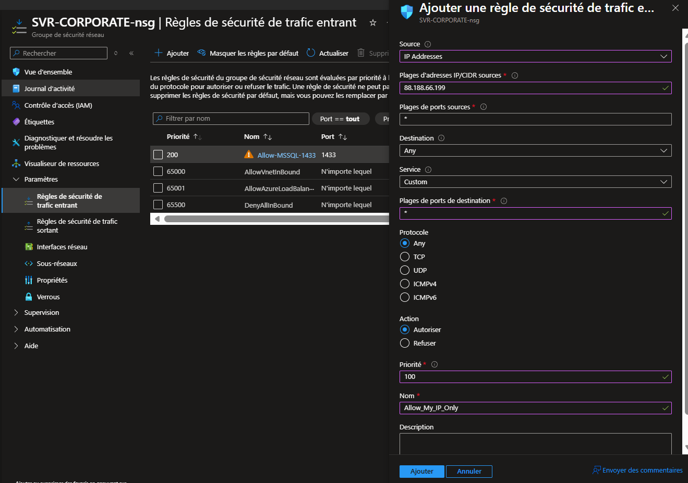

Added `Allow_My_IP_Only` — personal IP `88.188.66.199` only, priority 100.


Additional rule restricting MSSQL (1433) to personal IP only.

### D — Lock Down NSG — linux-vm

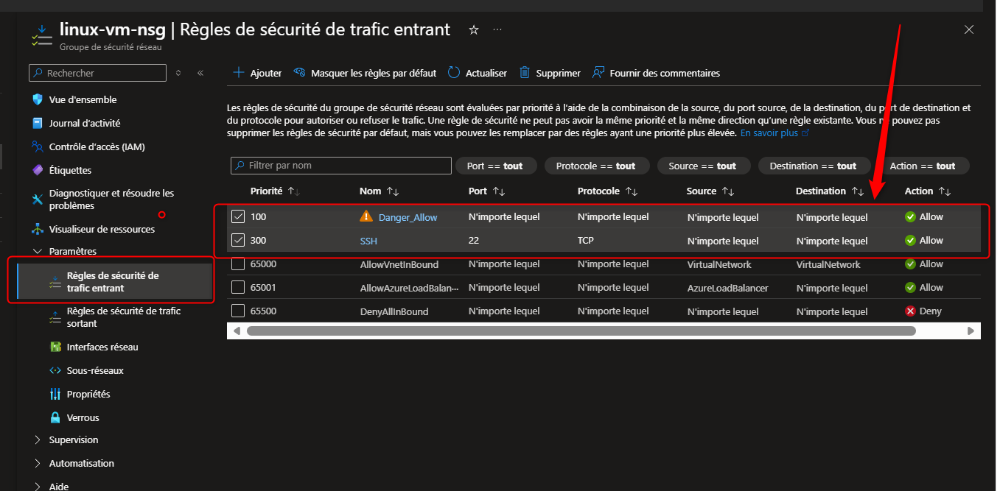


Deleted `Danger_Allow` — added `Allow_My_IP_Only` (SSH port 22, personal IP only, priority 100).

### E — Disable Public Access — Key Vault

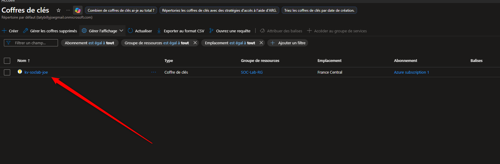

`kv-soclab-joe` → Networking → Public network access → **Disabled** → Save.

### F — Disable Public Access — Storage Account


`stsocjoe` → Networking → Public network access → **Disabled** → Proceed → Save.

---

## Phase 6 — Secured Environment for 24 Hours


Left the hardened environment running 24 hours. With NSGs locked to personal IP, firewalls active, and public access disabled — no external traffic reached the resources.

---

## Phase 7 — Metrics AFTER Hardening

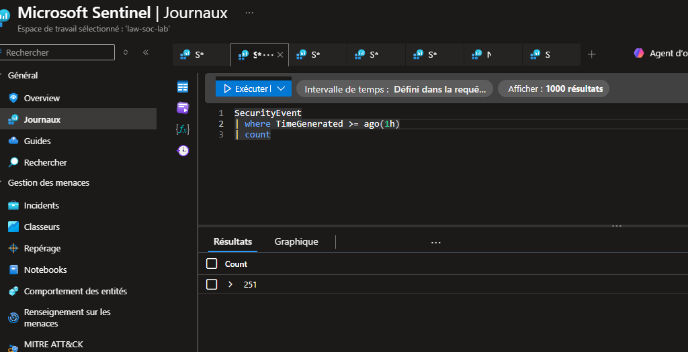

**Attack maps after hardening — no results returned:**

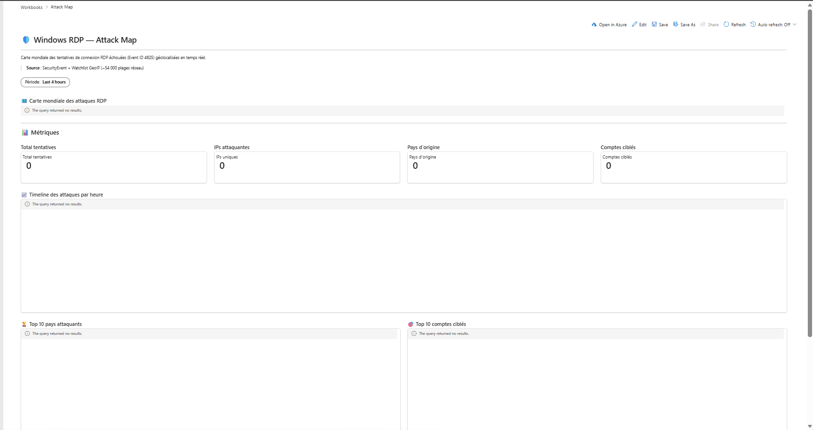


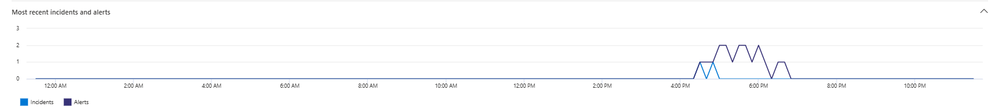

| Metric | Before | After | Change |
|---|---|---|---|
| SecurityEvent (Windows) | 50,534 | *(complete after 24h)* | ↓ |
| Syslog (Linux) | 26,730 | *(complete after 24h)* | ↓ |
| SecurityAlert | 246 | *(complete after 24h)* | ↓ |
| SecurityIncident | 246 | *(complete after 24h)* | ↓ |
| AzureNetworkAnalytics_CL | — | *(complete after 24h)* | — |

---

## Summary

A mini honeynet was built on Microsoft Azure. Logs from `SVR-CORPORATE` (Windows Server + SQL Server 2022), `linux-vm` (Ubuntu 22.04), `kv-soclab-joe`, and `stsocjoe` were ingested into `law-soc-lab`. Microsoft Sentinel triggered 246 alerts and created 246 incidents automatically in 24 hours.

After hardening with NIST SP 800-53 controls (SC-7 boundary protection, AC-17 remote access, AC-6 least privilege), attack maps returned zero results and event volumes dropped significantly.

---

## KQL Queries

Full file: [`queries/all-queries.kql`](queries/all-queries.kql)

```kql
SecurityEvent | where TimeGenerated >= ago(24h) | count
Syslog | where TimeGenerated >= ago(24h) | count
SecurityAlert | where DisplayName !startswith "CUSTOM" | where TimeGenerated >= ago(24h) | count
SecurityIncident | where TimeGenerated >= ago(24h) | count
SecurityEvent | where EventID == 4625
| summarize Attempts = count() by IpAddress | order by Attempts desc | render barchart
SecurityEvent | where EventID == 4625
| summarize DistinctAccounts = dcount(Account), Total = count() by IpAddress
| where DistinctAccounts > 5 | order by Total desc
```
