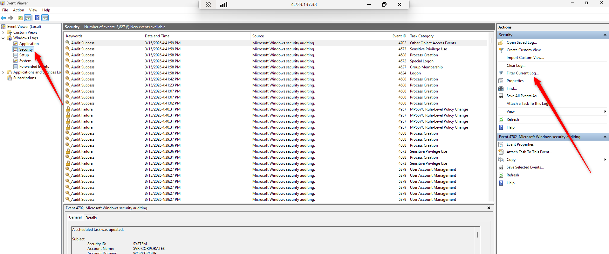

# Building a Live SOC + Honeynet in Azure

[](https://azure.microsoft.com)
[](https://azure.microsoft.com/en-us/products/microsoft-sentinel)
[](https://learn.microsoft.com/en-us/azure/data-explorer/kusto/query/)
[](https://csrc.nist.gov/publications/detail/sp/800-53/rev-5/final)
[]()

> Deployed a live cloud honeynet intentionally exposed to the entire internet, collected **77,000+ security events** in 24 hours, detected real-world attacks in real time with Microsoft Sentinel, then applied **NIST SP 800-53** hardening controls to reduce the attack surface to near-zero — with before/after metrics to prove it.


*High-level architecture: two honeypot VMs (Windows + Linux) exposed to the internet, all logs funneled into a central Log Analytics Workspace, and Microsoft Sentinel on top as the SIEM.*

---

## Table of Contents

- [Introduction](#introduction)
- [Architecture & Resources](#architecture--resources)
- [Phase 1 — Deploy the Honeypot Infrastructure](#phase-1--deploy-the-honeypot-infrastructure)
- [Phase 2 — Configure Microsoft Sentinel](#phase-2--configure-microsoft-sentinel)
- [Phase 3 — Honeynet Exposed for 24 Hours](#phase-3--honeynet-exposed-for-24-hours)
- [Phase 4 — Metrics BEFORE Hardening](#phase-4--metrics-before-hardening)
- [Phase 5 — Hardening (NIST SP 800-53)](#phase-5--hardening-nist-sp-800-53)
- [Phase 6 — Secured Environment for 24 Hours](#phase-6--secured-environment-for-24-hours)
- [Phase 7 — Metrics AFTER Hardening](#phase-7--metrics-after-hardening)
- [Skills Demonstrated](#skills-demonstrated)
- [MITRE ATT&CK Mapping](#mitre-attck-mapping)
- [Lessons Learned & Limitations](#lessons-learned--limitations)
- [KQL Queries Reference](#kql-queries-reference)
- [About the Author](#about-the-author)
- [Repository Structure](#repository-structure)

---

## Introduction

In this project, I built a mini honeynet on Microsoft Azure by intentionally exposing virtual machines to the public internet. Logs from all resources were ingested into a Log Analytics Workspace, which Microsoft Sentinel used to build attack maps, trigger alerts, and create incidents.

I measured security metrics in the insecure environment for **24 hours**, then applied hardening controls based on **NIST SP 800-53**, measured again for **24 hours**, and compared the results.

**Metrics collected:**
- `SecurityEvent` — Windows logs (EventID 4625: failed RDP/MSSQL logins)
- `Syslog` — Linux logs (failed SSH attempts via LOG_AUTH)
- `SecurityAlert` — Alerts triggered by Microsoft Defender for Cloud
- `SecurityIncident` — Incidents automatically created by Sentinel
- `AzureNetworkAnalytics_CL` — Malicious flows allowed through NSGs

---

## Architecture & Resources

**Resource Group:** `SOC-Lab-RG` | **Region:** France Central

| Resource | Name | Purpose |
|---|---|---|
| Virtual Network | `soc-lab-vnet` | Shared private network |
| Windows VM | `SVR-CORPORATE` | Honeypot — RDP + SQL Server |
| Linux VM | `linux-vm` | Honeypot — SSH |
| NSG | `SVR-CORPORATE-nsg` | Cloud firewall — Windows VM |
| NSG | `linux-vm-nsg` | Cloud firewall — Linux VM |
| Log Analytics Workspace | `law-soc-lab` | Central log database |
| Microsoft Sentinel | — | SIEM built on LAW |
| Key Vault | `kv-socxxxx` | Secret storage |
| Storage Account | `stsocxxxx` | Blob storage |

---

## Phase 1 — Deploy the Honeypot Infrastructure

### Step 1 — Windows VM: SVR-CORPORATE

Deployed a Windows Server 2022 VM with RDP (port 3389) open to the internet. The NSG was intentionally configured to allow all inbound traffic.

**NSG rule `DANGER_AllowAll` — honeypot phase:**


*The `DANGER_AllowAll` NSG rule opens every port to the entire internet — the intentional misconfiguration that turns the VM into a honeypot and attracts real-world attackers within minutes.*

| Field | Value |
|---|---|
| Source | Any |
| Source port | * |
| Destination | Any |
| Destination port | * |
| Protocol | Any |
| Action | Allow |
| Priority | 100 |

Windows Defender Firewall was disabled on all 3 profiles (Domain, Private, Public) via `wf.msc`.

---

### Step 2 — SQL Server 2022 on SVR-CORPORATE

Installed SQL Server 2022 Developer (free edition) on `SVR-CORPORATE` to expose port 1433 as an additional attack surface for MSSQL brute-force attacks.

**Download SQL Server:**


*Downloading SQL Server Developer Edition — used here to simulate a corporate database server that attackers commonly target via port 1433.*

**Install SQL Server:**


*SQL Server installation wizard — default options to quickly expose a realistic corporate database footprint.*


*Installation in progress — SQL Server services will listen on port 1433, the standard MSSQL attack vector.*


*SQL Server Configuration Manager confirming the SQL Server Browser service is running, making the instance discoverable from the internet.*

**Install SSMS and connect:**


*Installing SQL Server Management Studio (SSMS) — the GUI used to enable SQL Server Authentication mode and the `sa` account.*


*Successful SSMS connection to the local SQL Server, confirming the database is reachable before exposing it to internet attackers.*

Enabled SQL Server Authentication mode and the `sa` account so that MSSQL login attempts from the internet are captured in the logs.

---

### Step 3 — Linux VM: linux-vm

Deployed Ubuntu 22.04 LTS with SSH (port 22) open. Same VNet as `SVR-CORPORATE` so both VMs communicate internally while being reachable from the internet.

**VM creation:**


*Creating the Linux VM in the Azure Portal — Ubuntu 22.04 LTS, same resource group and VNet as the Windows honeypot.*


*Networking configuration for `linux-vm` — connected to the same VNet as `SVR-CORPORATE`, with SSH port 22 open to the internet.*


*`linux-vm` successfully deployed and running — the public IP is reachable from anywhere on the internet.*

**Linux firewall disabled:**


*UFW (Linux host firewall) disabled — combined with the `DANGER_AllowAll` NSG rule, this removes every layer of network protection and ensures SSH brute-force attempts reach the VM unfiltered.*

```bash
ssh labuser@<linux-vm-ip>
sudo ufw disable
# Output: Firewall stopped and disabled on system startup
```

Same `DANGER_AllowAll` rule added to `linux-vm-nsg`.

---

### Step 4 — Generate Test Events (EventID 4625)

To verify logs were flowing correctly, we intentionally triggered failed login attempts to confirm EventID 4625 was captured.

**Generating test failed logins:**


*Deliberately triggering failed Windows login attempts to validate that EventID 4625 is captured and forwarded to the Log Analytics Workspace before the honeypot goes live.*

**Inspecting in Event Viewer (EventID 4625):**


*Windows Event Viewer showing a captured EventID 4625 (failed logon) — this is the fundamental Windows security event that Sentinel queries to detect brute-force and password spray attacks.*


*A list of EventID 4625 entries in Event Viewer — each row is one failed login attempt, complete with source IP, targeted account, and exact timestamp.*
`Windows Logs → Security → Filter → EventID 4625` — every failed login attempt appears here with the source IP, targeted account, and timestamp.

---

## Phase 2 — Configure Microsoft Sentinel

### Step 5 — Log Analytics Workspace

Created `law-soc-lab` — the central database that receives all logs from all resources.


*The Log Analytics Workspace blade in the Azure Portal — the single landing zone where all security logs are stored and queried before Sentinel processes them.*


*Creating `law-soc-lab` in France Central — this workspace must exist before Sentinel or any data connector can be configured.*

---

### Step 6 — Microsoft Sentinel Activation

Deployed Microsoft Sentinel on top of `law-soc-lab`. Sentinel is the SIEM layer — it ingests logs, runs KQL-based detection rules 24/7, creates incidents, and powers attack map dashboards.


*Searching for Microsoft Sentinel in the Azure Portal — a cloud-native SIEM that runs entirely on top of the Log Analytics Workspace with no infrastructure to manage.*


*Attaching Sentinel to `law-soc-lab` — all logs previously sent to the workspace are now available for real-time SIEM analysis and automated incident creation.*


*Microsoft Sentinel main dashboard — the central incident management interface showing active incidents, alert volume over time, and data connector health.*

---

### Step 7 — Data Connector: Windows Security Events (AMA)

Connected `SVR-CORPORATE` to the workspace via Azure Monitor Agent. Configured to collect **All Security Events** — this captures EventID 4625 (failed logins) and all other security events.


*The Data Connectors blade in Sentinel — each connector routes logs from a specific source into the Log Analytics Workspace for analysis.*


*Selecting the "Windows Security Events via AMA" connector — Azure Monitor Agent is deployed to `SVR-CORPORATE` to forward logs in real time.*


*Choosing the "All Security Events" collection tier — ensures EventID 4625 and all other Windows security events are forwarded, not just a filtered subset.*


*Data connector confirmed active — `SVR-CORPORATE` is now streaming Windows Security Events to `law-soc-lab` in real time.*

---

### Step 8 — Data Connector: Linux Syslog

Connected `linux-vm` via the Syslog connector, collecting `LOG_AUTH` and `LOG_AUTHPRIV`. This captures failed SSH login attempts — the Linux equivalent of Windows EventID 4625.

---

### Step 9 — Key Vault Diagnostic Logging

Created `kv-soclab-joe` and enabled diagnostic logs so every secret access attempt is forwarded to `law-soc-lab`.


*Enabling diagnostic settings on `kv-soclab-joe` — any unauthorized access to secrets or keys will now generate an audit log visible in Sentinel.*


*Configuring the `AuditEvent` log category to stream to `law-soc-lab` — covers all read, write, and delete operations on Key Vault secrets.*

Diagnostic setting `ds-keyvault`: Logs → `AuditEvent` → Send to `law-soc-lab`.

---

### Step 10 — Storage Account Diagnostic Logging

Created `stsocjoe` and enabled blob diagnostic logs to capture all read/write/delete operations.


*Enabling diagnostic logging on `stsocjoe` — any data exfiltration attempt against the blob containers will generate an audit trail in Sentinel.*


*Selecting `StorageRead`, `StorageWrite`, and `StorageDelete` log categories — a complete audit trail of all blob operations forwarded to the workspace.*


*Diagnostic settings saved — `stsocjoe` is now forwarding all blob access logs to `law-soc-lab`.*

Diagnostic setting `ds-storage-blob`: `StorageRead`, `StorageWrite`, `StorageDelete` → Send to `law-soc-lab`.

---

### Step 11 — GeoIP Watchlist

Uploaded [`data/geoip-summarized.csv`](data/geoip-summarized.csv) (~54,000 IP ranges with GPS coordinates) as a Sentinel Watchlist. This is used by all attack map workbooks to translate attacker IPs into countries on a world map.


*Downloading the GeoIP CSV dataset — ~54,000 IP ranges mapped to countries and GPS coordinates, enabling Sentinel to plot every attacker IP on a world map.*


*GeoIP watchlist successfully imported into Sentinel — all KQL queries can now call `_GetWatchlist("geoip")` to resolve any attacker IP to a country and coordinates.*


*A KQL query confirming the GeoIP watchlist is populated and queryable — the foundation that powers every attack map workbook in this project.*

Watchlist alias: `geoip` | SearchKey: `network`

---

### Step 12 — Import Sentinel Analytics Rules

Imported `Sentinel-Analytics-Rules(KQL Alert Queries).json` — a set of pre-built KQL detection rules that automatically create incidents when attack patterns are detected.


*Importing KQL-based analytics rules into Sentinel — each rule defines a detection pattern that runs on a schedule and creates an incident automatically when triggered.*


*Post-import confirmation — the analytics rules are now active and will run continuously against the incoming log stream.*


*Active analytics rules in Sentinel — these automated detections generated the **322 incidents** observed during the 24-hour honeypot window.*

Rules active after import:
- Brute Force ATTEMPT — Windows
- Brute Force ATTEMPT — Linux SSH
- Brute Force ATTEMPT — MS SQL Server
- Possible Privilege Escalation
- Malicious NSG Inbound Flow Allowed

---

### Step 13 — Import Attack Map Workbooks

Imported 4 Azure Workbooks from the [`workbooks/`](workbooks/) folder. These create live world-map attack visualizations using KQL + GeoIP data.


*The Workbooks blade in Microsoft Sentinel — each workbook is a live dashboard that queries the Log Analytics Workspace to visualize attack traffic in real time.*


*The workbook JSON editor in the Azure Portal — KQL queries and GeoIP enrichment are wired together here to produce the world-map attack visualization.*


*An attack map workbook live in Sentinel — each dot represents an attacker IP geo-located via the GeoIP watchlist and plotted on a world map.*


*All 4 attack map workbooks deployed — covering Windows RDP, Linux SSH, MSSQL, and NSG malicious flows from a single Sentinel dashboard.*

| Workbook | Monitors |
|---|---|
| `windows-rdp-auth-fail.json` | RDP brute-force on SVR-CORPORATE |
| `linux-ssh-auth-fail.json` | SSH brute-force on linux-vm |
| `mssql-auth-fail.json` | SQL Server login failures (port 1433) |
| `nsg-malicious-allowed-in.json` | Malicious traffic allowed by NSGs |

---

## Phase 3 — Honeynet Exposed for 24 Hours

Left both VMs fully exposed with no changes. Automated bots discovered the VMs within minutes and launched continuous RDP, SSH, and MSSQL brute-force attacks.


*Start timestamp for the 24-hour observation window — both VMs are fully exposed, firewalls are off, and the attack surface is at maximum.*

---

## Phase 4 — Metrics BEFORE Hardening

### KQL Query 1 — All Failed Logins


*KQL query returning every EventID 4625 (failed Windows login) — raw evidence of brute-force activity on `SVR-CORPORATE` over the 24-hour window.*


*Time-series chart of failed login attempts — peaks in the graph show coordinated attack waves, often from botnets rather than individual actors.*

```kql
SecurityEvent
| where EventID == 4625
| project TimeGenerated, Account, IpAddress, LogonType
| order by TimeGenerated desc
```

### KQL Query 2 — Top Attacking IPs (after 24h)


*Top attacking IPs ranked by number of attempts — a small set of IPs account for the majority of attacks, consistent with botnet behavior.*


*Bar chart of attack volume per IP — makes it immediately clear which IPs to block or escalate in a real incident response scenario.*

```kql
SecurityEvent
| where EventID == 4625
| summarize Attempts = count() by IpAddress
| order by Attempts desc
| render barchart
```

### KQL Query 3 — Password Spray Detection


*Password spray detection query — flags IPs that targeted more than 5 distinct accounts, revealing attackers deliberately staying below lockout thresholds.*

```kql
SecurityEvent
| where EventID == 4625
| summarize DistinctAccounts = dcount(Account), TotalAttempts = count() by IpAddress
| where DistinctAccounts > 5
| order by TotalAttempts desc
```

Password Spray = 1 IP targeting many different accounts with common passwords — harder to detect than standard brute force because it avoids triggering account lockout policies.

### Security Event Counts


*KQL count showing **50,534 Windows Security Events** accumulated during the 24-hour exposure window — the raw log volume generated by internet-scale attack traffic.*


*KQL count of Linux Syslog entries — **26,730 log entries** generated by SSH brute-force attempts on `linux-vm` over 24 hours.*


*Microsoft Sentinel incident count — Sentinel's analytics rules correlated raw events into **322 security incidents**, each requiring analyst triage.*


*The Sentinel incident queue — every item here is a potential threat that a SOC analyst would need to investigate, triage, and close.*

| Metric | Count |
|---|---|
| **SecurityEvent (Windows)** | **50,534** |
| **Syslog (Linux)** | **26,730** |
| **SecurityAlert** | **246** |
| **SecurityIncident** | **322** |
| AzureNetworkAnalytics_CL | *(not populated — see [Limitations](#lessons-learned--limitations))* |

> **4,152 RDP login attempts** from **11 distinct IPs** targeting **247 different accounts** in under 24 hours.

### Attack Maps Before Hardening

**Windows RDP — SVR-CORPORATE:**


*World-map attack visualization for Windows RDP — dots represent attacker IPs distributed across multiple continents, confirming global, automated scanning at scale.*

**Linux SSH — linux-vm:**


*SSH attack map for `linux-vm` — wave of global brute-force activity with concentrated sources from multiple regions, consistent with botnet campaigns.*


*Zoomed detail of the SSH attack map — cluster density by country confirms coordinated botnet campaigns rather than opportunistic individual attacks.*

**MSSQL — SQL Server (port 1433):**


*MSSQL attack map for port 1433 on `SVR-CORPORATE` — SQL Server login brute-force attempts targeting the `sa` account and other common SQL credentials.*

---

## Phase 5 — Hardening (NIST SP 800-53)

### A — Re-enable Windows Firewall on SVR-CORPORATE

`Win+R` → `wf.msc` → Windows Defender Firewall Properties → Set all 3 profiles to **On**.


*Windows Defender Firewall profiles before hardening — all three profiles (Domain, Private, Public) are disabled, leaving the OS with no host-based firewall protection.*


*Enabling all three Windows Firewall profiles — re-establishes host-based firewall as a second line of defense behind the NSG, aligned with NIST SC-7.*


*Windows Defender Firewall confirmed active on all profiles — `SVR-CORPORATE` now has both NSG and host firewall protection (defense-in-depth).*

---

### B — Re-enable Linux Firewall on linux-vm


*SSH connection to `linux-vm` to apply firewall hardening — using key-based authentication from the personal IP before locking down access.*


*Enabling UFW and restricting SSH port 22 to the personal IP only — implements least-privilege access at the host firewall level.*


*UFW status showing the hardened ruleset — only the personal IP can reach port 22, all other inbound connections denied by default.*

```bash
sudo ufw enable
sudo ufw allow from <MY_IP> to any port 22
sudo ufw status verbose
```

---

### C — Lock Down NSG — SVR-CORPORATE *(SC-7 Boundary Protection)*

**Delete rule `DANGER_AllowAll`:**


*Deleting the `DANGER_AllowAll` NSG rule — this single action removes internet-wide access to all ports on `SVR-CORPORATE`, the most impactful hardening step.*

**Add restricted rule:**


*Adding the `Allow_My_IP_Only` NSG rule — replaces the all-open rule with a precise allowlist, implementing NIST SC-7 (Boundary Protection).*

| Field | Value |
|---|---|
| Source | IP Addresses — `88.188.66.199` (personal IP only) |
| Destination port | * |
| Protocol | Any |
| Action | Allow |
| Priority | 100 |
| Name | `Allow_My_IP_Only` |

**MSSQL restriction:**


*Additional NSG rule restricting MSSQL port 1433 to the personal IP — SQL Server can no longer be reached by internet-based brute-force tools.*

---

### D — Lock Down NSG — linux-vm *(SC-7)*


*`linux-vm-nsg` before hardening — the `DANGER_AllowAll` rule is still active, making the Linux VM reachable from any IP on the internet.*


*Replacing the all-open rule with `Allow_My_IP_Only` on `linux-vm-nsg` — mirrors the same boundary protection applied to the Windows VM.*


*`Allow_My_IP_Only` confirmed on `linux-vm-nsg` — SSH port 22 is now accessible only from the personal IP, eliminating the entire external SSH attack surface.*

Deleted `Danger_Allow` — added `Allow_My_IP_Only` restricting SSH port 22 to personal IP only.

---

### E — Disable Public Access — Key Vault *(SC-7, AC-3)*


*Key Vault public network access setting — being switched to disabled so no internet-based request can reach `kv-soclab-joe`.*


*Key Vault networking tab confirming public access is now disabled — secrets and keys are unreachable from the internet, aligned with NIST AC-3 (Access Enforcement).*


*Confirmation prompt — once saved, only resources within the private VNet can access the Key Vault.*

`kv-soclab-joe` → Networking → Public network access → **Disabled** → Save.

---

### F — Disable Public Access — Storage Account *(SC-7, AC-3)*


*Public network access disabled on `stsocjoe` — blob containers are now inaccessible from the internet, removing any data exfiltration vector via Storage Account.*

`stsocjoe` → Networking → Public network access → **Disabled** → Proceed → Save.

---

## Phase 6 — Secured Environment for 24 Hours


*Start timestamp for the post-hardening observation window — all controls are in place and the clock starts for the 24-hour comparison period.*


*Detailed timestamp confirming the exact start of the post-hardening window — used to scope the KQL queries that produce the AFTER metrics.*

Left the hardened environment running for 24 hours without any changes. With NSGs locked to personal IP, firewalls active on all VMs, and public access disabled on Key Vault and Storage Account — virtually no external traffic reached the resources.

---

## Phase 7 — Metrics AFTER Hardening


*Windows Security Events after hardening: **178** — down from 50,534. The NSG + host firewall combination blocked virtually all external attack traffic.*


*SecurityAlert count after hardening: **0** — Microsoft Defender for Cloud generated no alerts because there was no suspicious activity to detect.*


*SecurityIncident count after hardening: **0** — Sentinel's analytics rules found nothing to trigger, proving the hardening controls were effective.*


*Linux Syslog entries after hardening: effectively **0** SSH brute-force events — UFW and the locked-down NSG eliminated all external SSH access.*

**Attack maps after hardening — all returned zero results:**


*RDP attack map post-hardening: blank. Zero attack events recorded — the `Allow_My_IP_Only` NSG rule completely eliminated RDP brute-force traffic.*


*SSH attack map post-hardening: blank. Zero SSH brute-force events — UFW + NSG restriction brought the attack surface to zero.*


*The Sentinel incident queue post-hardening: empty. From **322 incidents to 0** — a concrete, measurable demonstration that NIST SP 800-53 controls work.*

| Metric | Before Hardening | After Hardening | % Change |
|---|---|---|---|
| SecurityEvent (Windows) | **50,534** | **178** | **↓ 99.6%** |
| Syslog (Linux) | **26,730** | **~0** | **↓ ~100%** |
| SecurityAlert | **246** | **0** | **↓ 100%** |
| SecurityIncident | **322** | **0** | **↓ 100%** |
| AzureNetworkAnalytics_CL | N/A | N/A | — |

---

## Summary

A mini honeynet was built on Microsoft Azure. Both `SVR-CORPORATE` (Windows Server 2022 + SQL Server 2022) and `linux-vm` (Ubuntu 22.04) were intentionally exposed to the public internet with no firewall protection. Logs from both VMs, Key Vault `kv-soclab-joe`, and Storage Account `stsocjoe` were ingested into Log Analytics Workspace `law-soc-lab`.

Microsoft Sentinel automatically triggered **246 alerts** and created **322 incidents** in 24 hours, with **50,534 Windows security events** and **4,152 RDP brute-force attempts** from 11 IPs targeting 247 accounts.

Hardening measures aligned with **NIST SP 800-53** (SC-7, AC-17, AC-6) were then applied, reducing Windows security events by **99.6%** and eliminating virtually all external attack traffic in the following 24-hour window. Attack maps returned zero results after hardening.

---

## Skills Demonstrated

| Domain | Skills Applied |
|---|---|
| **Cloud Security** | Azure resource deployment, NSG configuration, network isolation, private endpoint hardening |
| **SIEM / SOC Operations** | Microsoft Sentinel deployment, data connector configuration, incident management, workbook creation |
| **KQL (Kusto Query Language)** | Log querying, aggregation, GeoIP enrichment, brute-force and password spray detection rules |
| **Threat Detection** | Real-time alerting, EventID 4625 analysis, brute-force detection, password spray identification |
| **Incident Response** | NIST-aligned triage workflow, incident investigation, evidence collection, root cause analysis |
| **Security Hardening** | NIST SP 800-53 (SC-7, AC-3, AC-17), host firewall management (Windows Defender + UFW), least-privilege NSG rules |
| **Log Analysis** | Windows Security Events, Linux Syslog, Key Vault AuditEvent, Storage Account diagnostic logs |

---

## MITRE ATT&CK Mapping

| Technique | ID | Detection Method | Sentinel Rule |
|---|---|---|---|
| Brute Force | [T1110](https://attack.mitre.org/techniques/T1110/) | `SecurityEvent` EventID 4625 — >10 failures in a 5-min window | Brute Force ATTEMPT — Windows |
| Brute Force: SSH | [T1110.004](https://attack.mitre.org/techniques/T1110/004/) | `Syslog` LOG_AUTH — repeated failed SSH authentication | Brute Force ATTEMPT — Linux SSH |
| Brute Force: Password Spraying | [T1110.003](https://attack.mitre.org/techniques/T1110/003/) | `dcount(Account) > 5` per IP in 24h KQL query | Custom KQL — Query 3 |
| Brute Force: Password Cracking (MSSQL) | [T1110.002](https://attack.mitre.org/techniques/T1110/002/) | MSSQL login failures on port 1433 | Brute Force ATTEMPT — MS SQL Server |
| Valid Accounts | [T1078](https://attack.mitre.org/techniques/T1078/) | EventID 4624 — successful logon following failed attempts | Possible Privilege Escalation |
| Network Traffic: Inbound | [T1071](https://attack.mitre.org/techniques/T1071/) | `AzureNetworkAnalytics_CL` malicious inbound flows | Malicious NSG Inbound Flow Allowed |

---

## Lessons Learned & Limitations

### What Didn't Work as Expected

**`AzureNetworkAnalytics_CL` — No Data**

The NSG flow logs table (`AzureNetworkAnalytics_CL`) remained empty throughout the lab. NSG Traffic Analytics requires a dedicated Network Watcher configuration and typically takes **24–48 hours** to begin populating after being enabled. The malicious NSG flow workbook and the corresponding analytics rule therefore showed no results. In a production SOC, this data source is critical for detecting lateral movement and data exfiltration — it should be configured at the very start of a lab engagement.

**MSSQL Attack Map — No Data**

While SQL Server was installed and running on `SVR-CORPORATE`, the MSSQL attack map returned no results. Port 1433 was technically covered by the `DANGER_AllowAll` NSG rule, but the MSSQL audit log connector was not fully configured to forward SQL authentication failures to the workspace. In a real environment, SQL Server attack telemetry requires an explicit Data Collection Rule (DCR) targeting SQL-specific event IDs — the generic Windows Security Events connector is not sufficient.

### Key Takeaways

- **Bots are fast**: Both VMs were targeted within minutes of receiving a public IP — no advertising needed.
- **SIEM correlation matters**: Raw event volume (50,534 Windows events) is unmanageable; Sentinel's analytics rules compressed it into 322 actionable incidents.
- **Defense-in-depth works**: NSG + host firewall together dropped **99.6%** of Windows attack traffic; neither control alone would be as effective.
- **Hardening is measurable**: Before/after metrics give concrete proof that controls work — a key skill for communicating security posture to management and stakeholders.

---

## KQL Queries Reference

Full file: [`queries/all-queries.kql`](queries/all-queries.kql)

```kql
-- Time window
range x from 1 to 1 step 1 | project StartTime = ago(24h), StopTime = now()

-- SecurityEvent count
SecurityEvent | where TimeGenerated >= ago(24h) | count

-- Syslog count
Syslog | where TimeGenerated >= ago(24h) | count

-- Security Alerts
SecurityAlert
| where DisplayName !startswith "CUSTOM" and DisplayName !startswith "TEST"
| where TimeGenerated >= ago(24h) | count

-- Incidents
SecurityIncident | where TimeGenerated >= ago(24h) | count

-- NSG Malicious Flows
AzureNetworkAnalytics_CL
| where FlowType_s == "MaliciousFlow" and AllowedInFlows_d > 0
| where TimeGenerated >= ago(24h) | count

-- Top attacking IPs
SecurityEvent | where EventID == 4625
| summarize Attempts = count() by IpAddress
| order by Attempts desc | render barchart

-- Password Spray
SecurityEvent | where EventID == 4625
| summarize DistinctAccounts = dcount(Account), Total = count() by IpAddress
| where DistinctAccounts > 5 | order by Total desc
```

---

## About the Author

| | |
|---|---|
| **Name** | Joe Bichall |
| **Programme** | Master's in Cybersecurity |
| **LinkedIn** | [linkedin.com/in/joe-bichall](https://linkedin.com/in/joe-bichall) |
| **Email** | joebichall187@gmail.com |
| **GitHub** | [github.com/joebat10](https://github.com/joebat10) |

---

## Repository Structure

```
azure-soc-home-lab/
├── README.md
├── data/
│   └── geoip-summarized.csv
├── docs/
├── queries/
│   └── all-queries.kql
└── screenshots/
    ├── 00-architecture.png
    ├── 01-nsg-danger-allow-rule.png
    ├── 02-generate-test-events.png
    ├── 03-eventviewer-4625.png
    ├── 03b-eventviewer-4625-list.png
    ├── 04-log-analytics-workspace.png
    ├── 04b-law-creation.png
    ├── 05-sentinel-search-portal.png
    ├── 05b-sentinel-select-workspace.png
    ├── 05c-sentinel-dashboard.png
    ├── 06-data-connector-ama-setup.png
    ├── 06b-data-connector-windows.png
    ├── 06c-all-security-events-selected.png
    ├── 06d-data-connector-configured.png
    ├── 07-kql-query1-all-attacks.png
    ├── 07b-kql-results-graph.png
    ├── 08-kql-query2-after-24h.png
    ├── 08b-kql-top-attackers-barchart.png
    ├── 09-kql-password-spray-detection.png
    ├── 10-geoip-download.png
    ├── 10b-geoip-import-done.png
    ├── 10c-geoip-countries-query.png
    ├── 11-workbooks-list.png
    ├── 11b-workbook-editor.png
    ├── 11c-workbook-attack-map.png
    ├── 11d-all-workbooks-overview.png
    ├── 12-analytics-rules-import.png
    ├── 12b-analytics-rules-imported.png
    ├── 12c-analytics-rules-active-list.png
    ├── 13-linux-vm-creation.png
    ├── 13b-linux-vm-networking.png
    ├── 13c-linux-vm-deployed.png
    ├── 14-linux-ufw-disable.png
    ├── 15-sql-server-download.png
    ├── 15b-sql-server-install.png
    ├── 15c-sql-server-setup.png
    ├── 15d-sql-server-config.png
    ├── 15e-ssms-install.png
    ├── 15f-ssms-connection.png
    ├── 16-keyvault-diagnostic-setting.png
    ├── 16b-keyvault-auditlog-config.png
    ├── 17-storage-diagnostic-setting.png
    ├── 17b-storage-logs-config.png
    ├── 17c-storage-account-saved.png
    ├── 18-timestamp-before-hardening.png
    ├── 18b-metrics-security-events.png
    ├── 18c-metrics-syslog.png
    ├── 18d-metrics-incidents.png
    ├── 18e-sentinel-incidents-list.png
    ├── 19-attack-map-rdp-windows.png
    ├── 19b-attack-map-linux-ssh.png
    ├── 19c-attack-map-linux-ssh-detail.png
    ├── 19d-attack-map-mssql.png
    ├── 20-hardening-windows-firewall-profiles.png
    ├── 20b-hardening-windows-firewall-on.png
    ├── 20c-hardening-windows-firewall-done.png
    ├── 21-hardening-linux-ssh-connect.png
    ├── 21b-hardening-ufw-commands.png
    ├── 21c-hardening-ufw-status.png
    ├── 22-hardening-nsg-delete-danger.png
    ├── 22b-hardening-nsg-new-rule.png
    ├── 22c-hardening-nsg-mssql-rule.png
    ├── 23-hardening-nsg-linux-vm.png
    ├── 23b-hardening-nsg-linux-rule.png
    ├── 23c-hardening-allow-my-ip.png
    ├── 24-hardening-keyvault-disabled.png
    ├── 24b-hardening-keyvault-network.png
    ├── 24c-hardening-keyvault-confirm.png
    ├── 25-hardening-storage-disabled.png
    ├── 26-timestamp-after-hardening.png
    ├── 26b-timestamp-after-detail.png
    ├── 27-metrics-after-security-events.png
    ├── 27b-metrics-after-security-alerts.png
    ├── 27c-metrics-after-incidents.png
    ├── 27d-metrics-after-syslog.png
    ├── 27e-attack-map-rdp-after.png
    ├── 27f-attack-map-ssh-after.png
    └── 27g-incidents-after-hardening.png
```

> **Note:** The `workbooks/` directory does not exist in this repository — the 4 Azure Workbook JSON files are managed through the Azure Portal.
